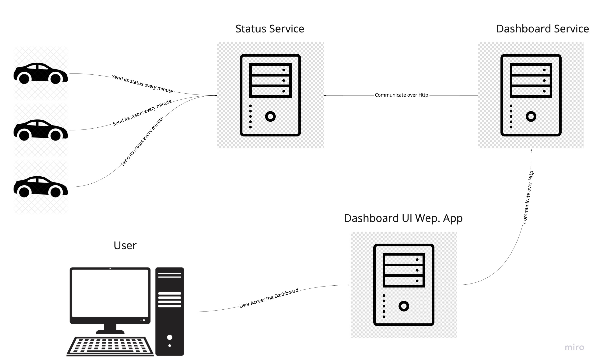

# AltenCodeChallenge

## This challenge task include:

- [Express](https://expressjs.com/)
- [React](https://reactjs.org/)
- [React-Bootstrap](https://react-bootstrap.github.io/)
- [Docker](https://www.docker.com/)

## Solution Architecture:

This Solution is divide into the following main microservices & components

1. **Dashboard UI Portal**: React Single Page Application (designed & implemented to support live updates) that provides users the ability to see An overview of all vehicles on one page (full-screen display), together with their status and the vehicles information. Also the user able to filter, to only show vehicles for a specific customer or show vehicles that have a specific status.

2. **Dashboard Service**: It provides all information needed for the Dashboard portal about vehicles as well as searching. It depends on anther Micro Service that provides it with the connected cars status. Communication between both services is done over http.

3. **Status Service** It is responsible for managing vehicle pings (implemented as get request with the car reg no.) thus logging the vehicles data as well update each machine with its status on local memory.

You can find architectural diagram of the task below.

## Project structure

The project is split into 3 main parts:

- `dashboard-service/`: Contains the dashboard service api, which is a Express app.
- `dashboard-ui/`: Contains the fornt-end web dashboard, which is React app.
- `status-service/`: Contains the dashboard service api, which is a Express app.

## Software installation prerequisites:

- [NodeJS](https://nodejs.org/en/) 12.14.0 or greater
- [Docker](https://www.docker.com/)

## Running Steps

1. Clone or download the projects from repo.
2. Run `docker-compose up`

## Running Steps for Development

3. Open each folder and Run `npm install`
4. Navigate `dashboard-ui` folder and run `npm run dev`
